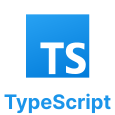

Run the command `npm install` to install the dependencies.
## Installation

Install my-project with npm

```bash
  npm install my-project
  cd my-project
```
  <div style="max-width: 500px;" align='center'>
  <table border='1' style='border: 1px solid #ddd; border-collapse: collapse;'>
    <tr>
      <th colspan='5'>
        <h3>Used Technologies</h3>
      </th>
    </tr>
    <tr>
      <td>
       
      </td>
      <td>
      
      </td>
      <td>
        
      </td>
      <td>
        
      </td>
      <td>
        
      </td>
    </tr>
  </table>
  </div>
